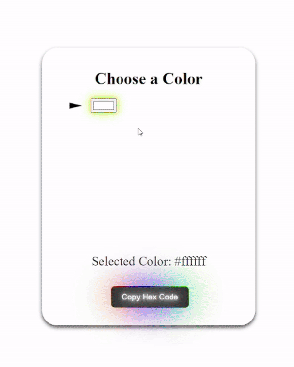
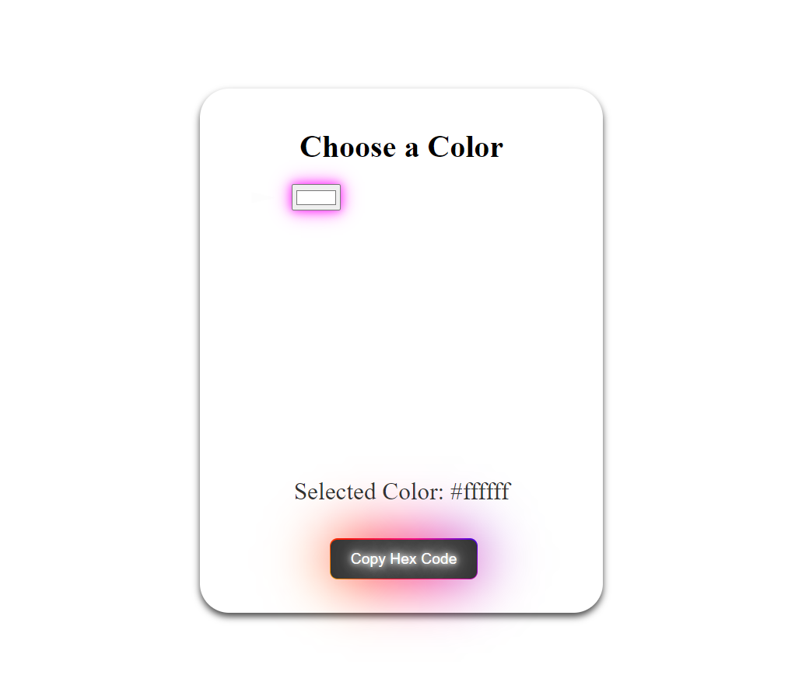

# ColorCodeCopy
This is a simple color picker tool that allows you to select colors and copy their hex codes.

Live link
[Click here to check out](https://madhurjyabaruah.github.io/ColorCodeCopy/color-picker/) 

Screenshots  

Screenshots/color_code_copy.gif

